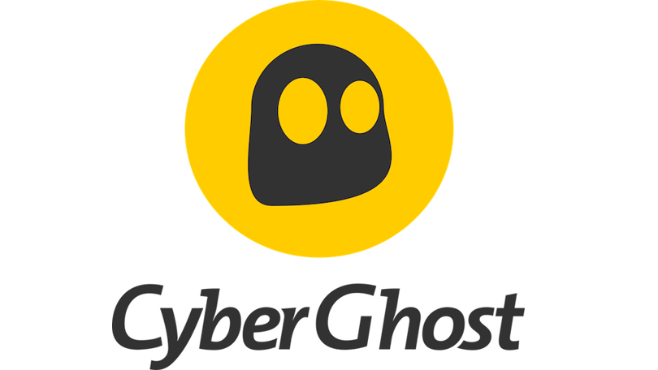
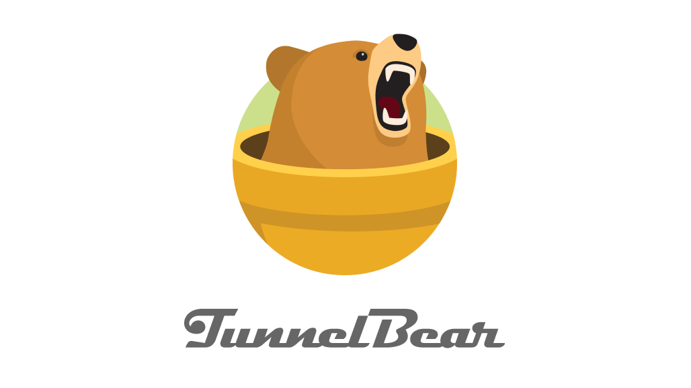
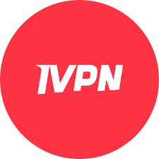
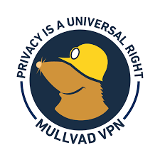

import { Link } from 'gatsby'

  It's no surprise that most people would prefer to stay invisible on the
  internet, to keep their identity and activities hidden from theft-minded
  hackers. Unfortunately, it's not immediately obvious how to make that happen.
  You might think anti-virus software is the key to safety, or that internet
  service providers (ISPs) have measures in place to keep your connection
  secure.

<blockquote>
  There are dozens of VPN services out there. Choose any of these to keep your
  online activities private and secure.
</blockquote>

<blockquote display="info">
  Pricing and availability are subject to change.
</blockquote>

Although there's no such thing as absolute internet privacy and security,
there's one tool you should think about adding to your arsenal: a **virtual
private network, or VPN.**

<h4>What a VPN does and why you should use one</h4>
 

**This is one of those things that sounds complicated but really isn't.** Imagine
you're tooling down the highway in your car, you and hundreds of other
drivers. A hacker is flying overhead in a helicopter; he can easily pinpoint
your location and follow you everywhere you go. You're totally unprotected.

Now imagine you're driving in a tunnel instead, one that's just for your car.
The hacker can't see you, doesn't even know you're there. **You're effectively
invisible.**

**When you connect to an open Wi-Fi network at, say, a coffee shop** or on an
airplane, you're driving that unprotected highway. But when you use a VPN — a
combination of software and service — you're in a tunnel. It's virtually
impossible for a hacker to detect you, monitor you, or steal anything from
you.

 

<h4>VPN pros and cons</h4>

**Let me pause to make something clear:** A VPN will not protect you from viruses,
nor from things like phishing threats or ransomware. Its sole function is to
hide your internet activities from observers who might wish to track them for
identity theft or other purposes.

**Here's the good news:** If you work primarily at home, you probably don't need a
VPN. That's because you're connecting to your own private Wi-Fi network; as
long as it's reasonably secure (starting with password protection), a VPN
would be overkill. It's the open, public networks out in the world that pose
the biggest threat. (That said, if you live in an apartment and you're, um,
borrowing Wi-Fi from a neighbor, you're definitely vulnerable.)

<blockquote>
  A VPN helps keep your online activities private, which is especially important
  when connecting to public Wi-Fi networks.
</blockquote>
 

<h4>There are a couple other caveats to using a VPN.</h4>

**First**, because your internet connection now routes through a secure server (the aforementioned "tunnel"), **there's a performance hit**. You might find that sites load a little slower or that video streaming isn't quite as reliable. Public Wi-Fi networks tend to be on the slow side to begin with; this added layer of protection can make them even slower.

**Second**, the VPN service itself may collect non-personal data about your browsing activities and may even sell that data to third parties. (I know, quite the irony.) Note that your ISP probably does this as well, so you'll have to decide whether this is important or not. If it is, choose a **VPN that doesn't log user activity or share data with third parties.**

**Finally**, there's cost: Most VPNs require a monthly or annual subscription fee. **There are a couple decent free ones out there, but they do have limitations** — and they're much more likely to log/sell your data.

 

<h4>Choosing the right VPN for you</h4>

Below I've rounded up what I consider to be the **top five VPN services**. I've made these choices based on a number of factors, including price, personal experience, customer ratings and aggregated reviews found elsewhere.

Unfortunately, very few of these offer free trials, meaning you can't easily "kick the tires." However, most come with a money-back guarantee, so although you'll need to choose a plan and provide a credit card for billing, you can cancel within that window and get a full refund.

 

<h4>Best VPN for global travelers:</h4>

 

One way to judge a VPN's efficacy is by the number and location of its servers. The more it has, and the more spread out they are, the easier it'll be to find one close by — regardless of where you're traveling. **Closer servers typically mean faster performance.**

**CyberGhost** has nearly 7,000 of them in over 90 countries; few other VPNs can match those numbers. And the service is headquartered in Romania, which has no mandatory data-collection laws. Consequently, CyberGhost is able to offer a no-logs policy.

You can try CyberGhost for free (it's the only VPN here to offer that option), but only for 24 hours. After that, you'll have to choose a plan, though each one comes with a generous 45-day money-back guarantee. Those plans start at **$12.99 per month**, with considerable discounts if you prepay for longer periods. At this writing, the rate drops to $6.39 if you prepay for six months (so, $38.34 total), or you can pay just **$58.50 for two years** and get two free months on top of that

<h4>Best independently audited VPN: TunnelBear</h4>

 
Sure, any VPN can claim it shields you from prying eyes, protects your personal data,
yada-yada-yada. But few put their money where their, er, tunnel is. TunnelBear (which
also has the cutest mascot this side of CyberGhost) publishes regular, independent
security audits of its own servers.
 
 
That's great, but here's what I like even better: TunnelBear offers a totally
free version, which at a minimum lets you try all the features without
committing to a plan. The catch: You're limited to 500MB of data per month.
That's fine for a few sessions of e-mail, web browsing and the like, but if you
dip into video even a little, you'll burn through that limit pretty quick.
 
 
From there, you can pay $9.99 monthly, $59.88 for one year or $120 for three years.
TunnelBear is also one of the more novice-friendly services out there, something
to consider if you're new to all this.
 
 
<h4>Best overall VPN: NordVPN</h4>

 
 
I've been in the technology industry for many years, and during that time I've
seen NordVPN at or near the top of just about every "best VPN" list. Indeed, it
ticks nearly all the important boxes — decent speeds, no-logs privacy, robust
server/country count, and easy interface — and affords the comfort of a solid
reputation: The company wouldn't be a top-rated service for so long if it didn't
offer a superior product.
 
 
NordVPN allows for up to six simultaneous connections and offers over 5,200 servers
in 60 countries. If anything, it might be overkill for some users, and perhaps a
little intimidating to novices. While features like Onion Over VPN and multi-hop
connections have value, they also require a bit of study to fully understand. That's
true with any VPN, but I came away from the NordVPN website feeling like I'd be in
over my head.
 
 
Perhaps unsurprisingly, NordVPN is on the pricier side of the spectrum: It costs
$11.95 per month, or $59 if you prepay for one year. The best deal is the
two-year option ($99 as of this writing), which includes a bonus three free
months. Take note, however, that these are introductory rates; renewal prices
may be higher. NordVPN offers a 30-day money-back guarantee on all plans.

<h4>Best VPN for serious privacy freaks: iVPN</h4>

 
 
There's anonymous and then there's anonymous. If you're serious about online
privacy, take a look at iVPN. Although its Standard plan limits you to just two
devices, it includes some pretty amazing safeguards.
 
 
For example, the built-in AntiTracker tool promises protection against ads, web trackers,
and malware. You can sign up for the service without even providing an e-mail address
and pay via Bitcoin for further anonymity. And iVPN promises a no-log policy and
audited operation.
 
 
Speaking of payment, iVPN is also quite affordable, especially if you're looking
for a month-to-month option: The aforementioned Standard plan costs $6, and
there's a 30-day money-back guarantee if you decide it's not a good fit.
 
 
Need coverage for more devices? The Pro plan lets you use seven of them, for a still-reasonable
$10 per month.

<h4>Best budget VPN: Mullvad</h4>

 
 
As you've probably noticed, most VPNs charge around $10-$12 if you choose a
month-to-month plan. That's pretty steep. Yes, there are discounts when you
prepay for a year or more, but what if you're not ready for that kind of
commitment?
 
 
Enter Mullvad, a Sweden-based VPN that charges a flat monthly rate regardless of
how long you subscribe. That rate is 5 euros, which currently works out to $5.91
US. Like iVPN, you can pay with Bitcoin or even actual cash if that's your jam. But
there are no discounts for longer subscriptions.
 
 
Fortunately, the budget price doesn't come at the cost of privacy or security:
Like the best VPNs, this one keeps no logs and submits to external, independent
audits. It doesn't have any affiliate partnerships, either, meaning you can rest
assured no one is getting paid to review or write about the product. Mullvad
supports up to five simultaneous connections and has servers in 36 countries —
but fewer than 800 of them total.
 
 
 
 

**Have you found a VPN you like better than those listed here? If so, I'd love
to receive your feedback in your social medias. Follow us @CodeSec on Instagram,
Facebook, Twitter, and LinkedIn for nonstop inspiration delivered fresh to your
feed, every day. Sign up here for CodeSec newsletter and have news about
CyberGhost and other products delivered to your inbox.**

<Link to="/posts" className="btn center-btn">
  all posts
</Link>
